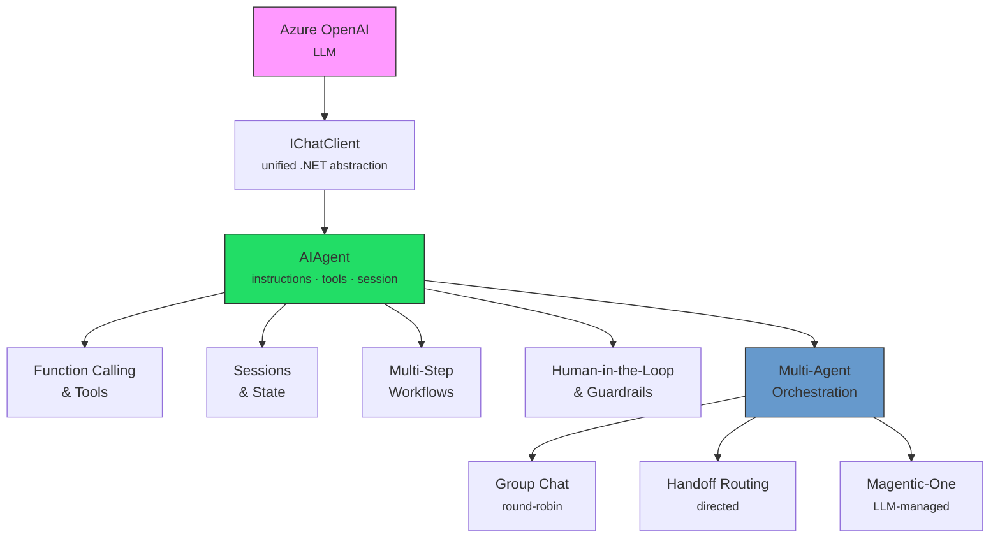
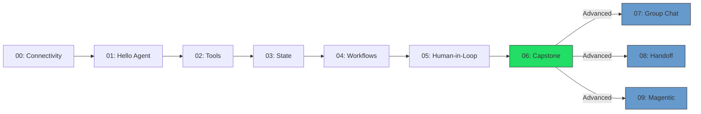

# Microsoft Agent Framework - .NET 10 Workshop

> **Build AI agents that reason, use tools, collaborate, and stay under human control — all in C# and .NET 10.**

A **hands-on workshop** (3 hours core + 1 hour advanced) that takes your team from zero to production-ready AI agent patterns using the **Microsoft Agent Framework**, **Azure OpenAI**, and plain console applications.

### Why this workshop?

- **AI agents are the next shift** — LLMs that can call tools, maintain state, and orchestrate multi-step workflows are replacing simple prompt-and-response patterns fast.
- **Secure by default** — every module teaches guardrails: path-traversal protection, tool approval policies, human-in-the-loop gates. Your team builds safe habits from day one.
- **No boilerplate, no distraction** — no Docker, no web UI, no frontend. Just C#, NuGet, and Azure OpenAI. Participants focus entirely on agent concepts.
- **Progressive complexity** — 10 modules go from "hello world" to multi-agent orchestration (group chat, handoff routing, LLM-managed teams). Each builds on the last.
- **Real-world scenario** — participants build a **software triage assistant** that reads build logs, searches a knowledge base, and produces structured incident cards — a pattern directly applicable to DevOps, support, and SRE workflows.

### What your team will learn

| Core (3 hours) | Advanced bonus (+1 hour) |
|----------------|--------------------------|
| Creating and configuring AI agents | Round-robin multi-agent group chat |
| Tool registration and function calling | Directed agent-to-specialist handoff routing |
| Session persistence across restarts | LLM-managed dynamic orchestration (Magentic-One pattern) |
| Multi-step analysis workflows | Comparing orchestration trade-offs |
| Human approval gates and tool policies | |
| Structured output (JSON Triage Cards) | |

---

## Prerequisites

| Requirement | Details |
|-------------|---------|
| .NET SDK | 10.0.100+ (any 10.0.x, configured via `global.json`) |
| Azure OpenAI | An Azure OpenAI resource with a chat model deployment (e.g., `gpt-4o`) |
| Shell | Bash (Linux/macOS) or PowerShell (Windows) |
| Editor | Visual Studio 2022+, VS Code with C# Dev Kit, or Rider |

---

## Key Concepts

This section introduces the ideas and terminology you will encounter throughout the workshop. You do not need to memorise everything up front — use it as a primer before you start, or as a reference while you code. The workshop moves from calling a single LLM, to wrapping that LLM in an **AI Agent** that can use tools and maintain state, to orchestrating **multiple agents** that collaborate on complex tasks. Each layer builds on the previous one, and the diagram below shows how they fit together.

### Concept Map



### Foundation

#### Large Language Models & Azure OpenAI

A **Large Language Model (LLM)** is a neural network trained on vast amounts of text that can generate, summarise, and reason about natural language. In this workshop every LLM call goes through [Azure OpenAI Service](https://learn.microsoft.com/azure/ai-services/openai/overview), which hosts models such as `gpt-4o` behind a secure, enterprise-grade API. You provide an **endpoint**, an **API key**, and a **deployment name**; the workshop code handles the rest. Modules 00–09 all share the same Azure OpenAI backend — the only thing that changes is what we ask the model to do and how we structure the conversation around it.

#### Tokens & Usage

LLMs do not process words — they process **tokens**, which are roughly ¾ of a word on average. Every API call consumes **input tokens** (your prompt) and **output tokens** (the model's reply), and Azure bills by token count. Understanding token usage matters for cost control and for staying within your deployment's **tokens-per-minute (TPM)** rate limit. This workshop includes a built-in token tracker that prints a usage summary after every module run, so you can see exactly how many tokens each exercise costs. See [Azure OpenAI pricing and quotas](https://learn.microsoft.com/azure/ai-services/openai/quotas-limits) for details.

#### System Prompts

A **system prompt** (also called **system message** or **instructions**) is a block of text sent at the start of every conversation that tells the model how to behave — its role, tone, constraints, and output format. Well-crafted system prompts are the single most important lever for controlling agent behaviour. In this workshop, system prompts are stored as editable Markdown files in `assets/prompts/` and loaded at runtime, so you can tweak behaviour without changing any C# code. The workshop uses layered prompt composition: a base behaviour prompt, a safety-constraints prompt, and (in later modules) a domain-specific rubric prompt are concatenated into one instruction string. See [System message best practices](https://learn.microsoft.com/azure/ai-services/openai/concepts/system-message) for guidance.

### Agency

#### AI Agents

An **AI Agent** is more than a raw LLM call. It wraps an LLM with **instructions** (system prompt), optional **tools** it can invoke, and a **session** that tracks conversation history. Where a plain chat completion is stateless and passive, an agent can reason over multiple turns, decide which tools to call, and maintain context across an entire interaction. In the Microsoft Agent Framework, you create an agent by calling `chatClient.AsAIAgent(instructions, tools)`, which returns an `AIAgent` instance. You then create an `AgentSession` and call `RunAsync()` or `RunStreamingAsync()` to get responses. Module 00 creates your first agent; by Module 06 you have a fully-featured triage assistant. See [Microsoft Agent Framework on GitHub](https://github.com/microsoft/Agents) for the source and API reference.

#### Function Calling & Tools

**Function calling** (also called **tool use**) is the mechanism by which an LLM decides to invoke a registered function to retrieve data or perform an action, rather than generating an answer from its training data alone. You register C# methods as tools using `AIFunctionFactory.Create()` and pass them to the agent at creation time. The model sees each tool's name, description, and parameter schema, and can choose to call one or more tools during a conversation turn — the framework executes the function and feeds the result back to the model automatically. This workshop registers three tools: `GetTime`, `ReadFile`, and `SearchKb`. Module 02 introduces function calling. See [Function calling with Azure OpenAI](https://learn.microsoft.com/azure/ai-services/openai/how-to/function-calling) for the underlying protocol.

#### Grounding

**Grounding** is the practice of anchoring an LLM's answers in real, verifiable data instead of relying solely on its training knowledge. Without grounding, models can "hallucinate" — produce plausible-sounding but incorrect information. In this workshop, the `ReadFile` and `SearchKb` tools ground the agent by giving it access to actual build logs and knowledge-base articles at query time. The model reads the tool output and bases its analysis on that evidence, significantly improving accuracy. Grounding is a foundational technique for building trustworthy AI systems and is essential in production agent architectures. See [Retrieval-Augmented Generation (RAG)](https://learn.microsoft.com/azure/ai-services/openai/concepts/retrieval-augmented-generation) for the broader pattern.

### Patterns

#### Sessions & State

A **session** represents a single conversation between a user and an agent. It holds the message history — every user message, assistant reply, and tool call — so the model has context for follow-up questions. By default, sessions live in memory and disappear when the process exits. Module 03 introduces **session persistence**: saving the conversation to a JSON file and reloading it later, so a user can resume where they left off. The `SessionStore` class handles serialisation via `System.Text.Json`. Session management is critical in production systems for audit trails, debugging, and multi-turn workflows. See [Conversation history management](https://learn.microsoft.com/azure/ai-services/openai/how-to/chatgpt) for best practices.

#### Multi-Step Workflows

A **multi-step workflow** (or **pipeline**) chains several LLM calls in sequence, where each step has a distinct role and the output of one step feeds into the next. This is more powerful than a single prompt because each step can focus on one task (plan, gather evidence, critique, synthesise) without exceeding the model's context window or attention limits. Module 04 implements a four-step pipeline: **Plan → Evidence → Critique → Final Report**. Each step uses its own `AgentSession` to prevent context leaking between roles. The pattern is directly applicable to any analysis, review, or decision-making task. See [Prompt engineering — chain of thought](https://learn.microsoft.com/azure/ai-services/openai/concepts/advanced-prompt-engineering) for the reasoning technique behind it.

#### Structured Output

**Structured output** means instructing the model to respond in a specific, parseable format — typically JSON with a defined schema. Instead of free-form text, the model fills in fields like `summary`, `category`, `confidence`, and `next_steps`. The application can then deserialise the response with `System.Text.Json` and process it programmatically. Module 04 introduces structured JSON output; Module 06 uses it for the full **Triage Card** — a domain-specific incident report with severity, owner, and recommended actions. Structured output is what turns an LLM from a text generator into a data producer. See [Structured outputs with Azure OpenAI](https://learn.microsoft.com/azure/ai-services/openai/how-to/structured-outputs) for schema enforcement options.

#### Human-in-the-Loop & Guardrails

**Human-in-the-loop (HITL)** is a design pattern where a human reviews, approves, or corrects an agent's decisions at key checkpoints before the agent proceeds. It is essential for high-stakes workflows where errors have real consequences. Module 05 introduces two complementary mechanisms: **approval gates** (the user must type `approve`, `revise`, or `abort` after seeing the agent's plan) and **tool approval policies** (each tool is tagged as `AlwaysAllow`, `RequireApproval`, or `Deny`, enforced in application code before execution). Together, these ensure that the agent cannot take irreversible actions without human consent. The key insight is that guardrails live in your C# code, not in the model — the model is informed of the outcome but cannot bypass the policy. See [Responsible AI practices for Azure OpenAI](https://learn.microsoft.com/azure/ai-services/openai/concepts/safety-system-message-templates) for broader safety guidance.

### Orchestration

#### Multi-Agent Systems

A **multi-agent system** uses several specialised agents — each with its own instructions, tools, and role — to collaborate on a task that is too complex or too broad for a single agent. Instead of one agent that knows everything, you have a **Planner** that creates a plan, an **Investigator** that gathers evidence, a **Critic** that challenges assumptions, and a **Scribe** that writes the final report. The challenge is **orchestration**: deciding which agent speaks next, what context they share, and when the task is done. This workshop explores three orchestration patterns (Modules 07–09), each with different trade-offs between simplicity, predictability, and adaptivity.

#### Group Chat (Round-Robin)

In the **group chat** pattern, multiple agents take turns in a fixed, rotating order — like people sitting around a table, each speaking in turn. A **`RoundRobinGroupChatManager`** coordinates the rotation and enforces a maximum iteration count. All agents share the same conversation history, so each can see what the others have said. This pattern is the simplest to implement and reason about, but it is rigid: every agent speaks every round regardless of whether they have something useful to add. Module 07 implements this using the `AgentWorkflowBuilder` API from `Microsoft.Agents.AI.Workflows`. Best for tasks where every perspective is always needed. See [Microsoft Agent Framework — Workflows](https://github.com/microsoft/Agents) for the API.

#### Handoff Routing

In the **handoff** pattern, an agent explicitly transfers control to another agent based on the content of the conversation — like a receptionist routing a caller to the right department. A **front-desk agent** examines the incoming failure report, categorises it (infrastructure, product code, or test), and hands off to the matching specialist. Handoff routes are declared as a directed graph: `WithHandoff(from, to, description)`. The description guides the model's routing decision, making this **semantic routing** rather than rule-based. This pattern is more efficient than group chat (only relevant agents participate) but requires you to define the routing topology up front. Module 08 implements this. Best for tasks with clear specialisation boundaries.

#### Magentic-One (Manager-Driven Orchestration)

The **Magentic-One** pattern, inspired by [Microsoft Research](https://www.microsoft.com/en-us/research/articles/magentic-one-a-generalist-multi-agent-system-for-solving-complex-tasks/), places an LLM-powered **manager** in charge of dynamically choosing which agent speaks next. At each iteration, the manager reviews a rolling progress summary, decides which specialist to activate, assigns a specific task, and estimates a confidence score. When confidence crosses a threshold (e.g., 0.75) or the maximum iteration count is reached, the workflow terminates. This is the most adaptive pattern — the manager can skip agents, revisit earlier specialists, or call the same agent twice — but it is also the most expensive (every iteration costs an extra LLM call for the manager) and the hardest to predict. Module 09 implements this manually using the `AIAgent` API, since the framework does not yet include a built-in Magentic manager. Best for open-ended, complex tasks where the optimal agent sequence is not known in advance.

### The .NET Package Stack

The workshop builds on a layered stack of NuGet packages. Each layer adds a higher-level abstraction:

```
Azure.AI.OpenAI          → raw Azure OpenAI SDK (HTTP client, auth)
  └─ Microsoft.Extensions.AI       → IChatClient, AITool, DelegatingChatClient
       └─ Microsoft.Agents.AI           → AIAgent, AgentSession, AgentResponse
            └─ Microsoft.Agents.AI.Workflows  → AgentWorkflowBuilder, GroupChat, Handoff
```

| Package | Abstraction | Used in |
|---------|-------------|---------|
| `Azure.AI.OpenAI` | `AzureOpenAIClient`, `ApiKeyCredential` — HTTP-level access to the model | All modules |
| `Microsoft.Extensions.AI` | `IChatClient` — vendor-neutral chat interface; `AIFunctionFactory` for tools | All modules |
| `Microsoft.Extensions.AI.OpenAI` | `AsIChatClient()` — wraps the Azure SDK as `IChatClient` | All modules |
| `Microsoft.Agents.AI` | `AIAgent`, `AgentSession` — agent lifecycle, instructions, streaming | All modules |
| `Microsoft.Agents.AI.OpenAI` | OpenAI-specific agent provider registration | All modules |
| `Microsoft.Agents.AI.Workflows` | `AgentWorkflowBuilder`, `RoundRobinGroupChatManager`, `WithHandoff` | Modules 07–08 |

> Module 09 does **not** use the Workflows package — it implements the Magentic-One pattern manually to show how orchestration works under the hood.

### Quick-Reference Glossary

| Term | Definition | Module | Link |
|------|-----------|--------|------|
| Azure OpenAI | Microsoft's cloud-hosted LLM service (GPT-4o, etc.) | 00 | [Docs](https://learn.microsoft.com/azure/ai-services/openai/overview) |
| Token | The unit LLMs process (~¾ of a word); drives cost and rate limits | 00 | [Quotas](https://learn.microsoft.com/azure/ai-services/openai/quotas-limits) |
| `IChatClient` | Vendor-neutral .NET interface for chat models | 00 | [M.E.AI](https://learn.microsoft.com/dotnet/ai/ai-extensions) |
| `AIAgent` | LLM + instructions + tools + session — the core agent type | 00 | [GitHub](https://github.com/microsoft/Agents) |
| System prompt | Instructions that define agent behaviour, role, and constraints | 01 | [Best practices](https://learn.microsoft.com/azure/ai-services/openai/concepts/system-message) |
| Streaming | Token-by-token response delivery via `RunStreamingAsync()` | 01 | — |
| Function calling | Model autonomously invokes registered C# methods to retrieve data | 02 | [Guide](https://learn.microsoft.com/azure/ai-services/openai/how-to/function-calling) |
| `AITool` / `AIFunctionFactory` | .NET types for registering callable tools with an agent | 02 | [M.E.AI](https://learn.microsoft.com/dotnet/ai/ai-extensions) |
| Grounding | Anchoring answers in real data (files, KB) to prevent hallucination | 02 | [RAG](https://learn.microsoft.com/azure/ai-services/openai/concepts/retrieval-augmented-generation) |
| Session persistence | Saving conversation history to JSON for resume and audit | 03 | [Conversations](https://learn.microsoft.com/azure/ai-services/openai/how-to/chatgpt) |
| Multi-step workflow | Chained LLM calls (Plan → Evidence → Critique → Final) | 04 | [CoT](https://learn.microsoft.com/azure/ai-services/openai/concepts/advanced-prompt-engineering) |
| Structured output | Instructing the model to return JSON matching a defined schema | 04 | [Guide](https://learn.microsoft.com/azure/ai-services/openai/how-to/structured-outputs) |
| Human-in-the-loop | Human approval gates before the agent takes consequential actions | 05 | [Safety](https://learn.microsoft.com/azure/ai-services/openai/concepts/safety-system-message-templates) |
| Tool approval policy | Per-tool `AlwaysAllow` / `RequireApproval` / `Deny` enforcement | 05 | — |
| Triage Card | Structured incident report (summary, category, severity, owner) | 06 | — |
| Prompt composition | Layering base + safety + rubric prompts into one instruction string | 06 | [Prompt eng.](https://learn.microsoft.com/azure/ai-services/openai/concepts/prompt-engineering) |
| Group chat | Round-robin multi-agent orchestration with shared history | 07 | [GitHub](https://github.com/microsoft/Agents) |
| Handoff routing | Directed agent-to-specialist transfer based on semantic matching | 08 | [GitHub](https://github.com/microsoft/Agents) |
| Magentic-One | LLM-managed dynamic orchestration; manager selects agents per turn | 09 | [Paper](https://www.microsoft.com/en-us/research/articles/magentic-one-a-generalist-multi-agent-system-for-solving-complex-tasks/) |
| `DelegatingChatClient` | Wrapper base class for intercepting LLM calls (e.g., token tracking) | 00 | [M.E.AI](https://learn.microsoft.com/dotnet/ai/ai-extensions) |

---

## Environment Variables

Your workshop facilitator will provide the values below. If you already have your own Azure OpenAI resource, you can use that instead. (Setting up Azure OpenAI / Azure AI Foundry resources is outside the scope of this workshop.)

All modules use the same four environment variables:

| Variable | Required | Example |
|----------|----------|---------|
| `AZURE_OPENAI_ENDPOINT` | ✅ Yes | `https://myresource.openai.azure.com/` |
| `AZURE_OPENAI_API_KEY` | ✅ Yes | `sk-...` |
| `AZURE_OPENAI_DEPLOYMENT` | ✅ Yes | `gpt-4o` |
| `AZURE_OPENAI_API_VERSION` | ⬜ Optional | `2025-01-01-preview` (default if unset) |

### Setting environment variables

**Linux / macOS:**
```bash
export AZURE_OPENAI_ENDPOINT="https://myresource.openai.azure.com/"
export AZURE_OPENAI_API_KEY="your-api-key"
export AZURE_OPENAI_DEPLOYMENT="gpt-4o"

# Check / diagnose
./scripts/set-env.sh
```

**Windows PowerShell:**
```powershell
$env:AZURE_OPENAI_ENDPOINT = "https://myresource.openai.azure.com/"
$env:AZURE_OPENAI_API_KEY = "your-api-key"
$env:AZURE_OPENAI_DEPLOYMENT = "gpt-4o"

# Check / diagnose
./scripts/set-env.ps1
```

---

## Quickstart

```bash
# 1. Clone the repository
git clone https://github.com/PeterMilovcik/MicrosoftAgentFramework.Dotnet.Workshop
cd MicrosoftAgentFramework.Dotnet.Workshop

# 2. Set environment variables (see above)

# 3. Build everything
dotnet build AgentFrameworkWorkshop.slnx

# 4. Run the connectivity check
./scripts/run.sh 00        # Linux/macOS
./scripts/run.ps1 00       # Windows PowerShell

# 5. Start the workshop - module 01
./scripts/run.sh 01        # Linux/macOS
./scripts/run.ps1 01       # Windows PowerShell
```

Or run directly:
```bash
dotnet run --project modules/00_ConnectivityCheck
dotnet run --project modules/01_HelloAgent
```

---

## Repository Structure

```
agent-framework-dotnet-workshop/
  README.md                   ← You are here
  AgentFrameworkWorkshop.slnx ← Solution file (.NET 10 format)
  Directory.Packages.props    ← Centralized NuGet version management
  Directory.Build.props       ← Shared build properties (nullable, lang version)
  .editorconfig               ← Coding style
  global.json                 ← Pins .NET SDK version
  assets/
    prompts/                  ← Editable system prompt files
      system-base.md
      system-safety.md
      triage-rubric.md
      agents/                 ← Per-agent prompts for multi-agent modules
    sample-data/              ← Realistic data for exercises
      build-log-01.txt
      build-log-02.txt
      kb/
        testing-guidelines.md
        release-notes.md
  scripts/
    set-env.sh / set-env.ps1  ← Diagnose missing env vars
    run.sh / run.ps1          ← Run a module by number
  modules/
    00_ConnectivityCheck/     ← Azure OpenAI connectivity check
    01_HelloAgent/            ← Basic agent + REPL loop
    02_Tools_FunctionCalling/ ← Tools: GetTime, ReadFile, SearchKb
    03_State_Sessions_Persistence/ ← Sessions + JSON persistence
    04_Workflows_MultiStep/   ← 4-step analysis pipeline
    05_HumanInLoop_Guards/    ← Human approval gates + tool policy
    06_Capstone_TriageAssistant/ ← Full triage assistant
    07_GroupChat_Orchestration/  ← Round-robin multi-agent group chat
    08_Handoff_Orchestration/    ← Directed agent-to-agent routing
    09_Magentic_ManagerOrchestration/ ← LLM-managed dynamic orchestration
```

---

## NuGet Packages Used

| Package | Version | Purpose |
|---------|---------|---------|
| `Microsoft.Agents.AI` | 1.0.0-rc1 | Core Agent Framework |
| `Microsoft.Agents.AI.OpenAI` | 1.0.0-rc1 | OpenAI/Azure OpenAI provider |
| `Microsoft.Agents.AI.Workflows` | 1.0.0-rc1 | Multi-agent orchestration (Group Chat, Handoff) |
| `Microsoft.Extensions.AI` | 10.3.0 | Unified AI abstractions (`IChatClient`) |
| `Microsoft.Extensions.AI.OpenAI` | 10.3.0 | `AsIChatClient()` extension |
| `Azure.AI.OpenAI` | 2.1.0 | Azure OpenAI SDK |

---

## Workshop Timeline (3h core + 1h advanced)

| Time | Module | Topic |
|------|--------|-------|
| 0:00 | **00** | Connectivity check - verify env vars & Azure OpenAI |
| 0:10 | **01** | Hello Agent - system prompt + conversation REPL |
| 0:35 | **02** | Tools & Function Calling - GetTime, ReadFile, SearchKb |
| 1:10 | **03** | State, Sessions & Persistence - JSON session store |
| 1:35 | **04** | Workflows - 4-step analysis pipeline |
| 2:15 | **05** | Human-in-the-Loop - approval gates + tool policy |
| 2:40 | **06** | Capstone - full Triage Assistant |
| 3:00 | 🎉 | Core workshop complete! |

### Advanced Modules (Bonus, ~75 minutes)

These modules explore **multi-agent orchestration patterns** and build on concepts from the core workshop. Complete them if time allows or as self-paced follow-up.

| Time | Module | Topic |
|------|--------|-------|
| 3:10 | **07** | Group Chat - round-robin multi-agent orchestration |
| 3:35 | **08** | Handoff - directed agent-to-specialist routing |
| 4:00 | **09** | Magentic Manager - dynamic LLM-driven orchestration |
| 4:15 | 🎉 | Full workshop complete! |

> **Note on token usage:** Multi-agent modules (07–09) make multiple LLM calls per run (~4–8 calls). If you encounter rate limiting errors (HTTP 429), wait a moment and retry. For workshops with many participants, ensure your Azure OpenAI deployment has adequate TPM (tokens per minute) capacity. Each module displays a token usage summary on exit.

---

## Workshop Progression



---

## Editing Prompts

All agent prompts live in `assets/prompts/`. Edit them without touching any code:

- **`system-base.md`** - Core assistant behavior
- **`system-safety.md`** - Tool-use constraints and guardrails
- **`triage-rubric.md`** - Structured output schema for the capstone

Changes take effect immediately on next `dotnet run` (files are copied to build output).

---

## Troubleshooting

### Missing environment variables

If you see `❌ Missing required environment variables`, run the diagnostic script:

```bash
./scripts/set-env.sh     # Linux/macOS
./scripts/set-env.ps1    # Windows PowerShell
```

### Azure OpenAI API errors

| Error | Likely Cause | Fix |
|-------|-------------|-----|
| `401 Unauthorized` | Invalid API key | Verify `AZURE_OPENAI_API_KEY` is correct and not expired |
| `404 Not Found` | Wrong deployment name | Check `AZURE_OPENAI_DEPLOYMENT` matches your Azure portal |
| `429 Too Many Requests` | Rate limit exceeded | Wait 30–60 seconds, retry. Increase TPM quota in Azure portal |
| `Connection refused` | Wrong endpoint URL | Ensure `AZURE_OPENAI_ENDPOINT` includes trailing `/` |

### .NET SDK issues

- **SDK not found:** Install .NET 10 SDK from [dot.net](https://dot.net). Verify with `dotnet --version`.
- **Build errors on first run:** Run `dotnet restore AgentFrameworkWorkshop.slnx` first.

### NuGet package restore failures

In corporate environments, the default `nuget.org` source may be missing or disabled. To check and fix:

```bash
# List configured NuGet sources
dotnet nuget list source

# If nuget.org is missing or disabled, add/enable it:
dotnet nuget add source https://api.nuget.org/v3/index.json -n nuget.org

# Or enable a disabled source:
dotnet nuget enable source nuget.org
```

Then retry `dotnet restore AgentFrameworkWorkshop.slnx`.

### Rate limiting with multiple participants

When running the workshop with many participants sharing one Azure OpenAI deployment:

1. **Increase TPM quota** in [Azure AI Foundry portal](https://ai.azure.com) → Deployments → your model → Edit → increase tokens per minute.
2. **Use separate deployments** if possible — one per participant or per table.
3. **Stagger module starts** — not everyone needs to run Module 07–09 simultaneously.

---

## License

MIT - see [LICENSE](LICENSE).
