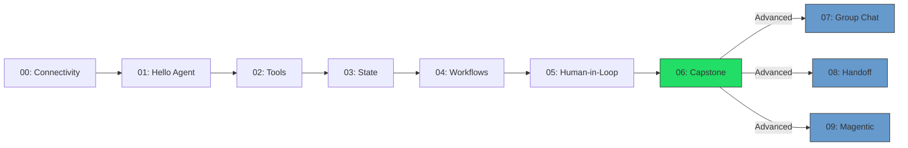

# Microsoft Agent Framework - .NET 10 Workshop

> **Build AI agents that reason, use tools, collaborate, and stay under human control — all in C# and .NET 10.**

A **hands-on workshop** (3 hours core + 1 hour advanced) that takes your team from zero to production-ready AI agent patterns using the **Microsoft Agent Framework**, **Azure OpenAI**, and plain console applications.

### Why this workshop?

- **AI agents are the next shift** — LLMs that can call tools, maintain state, and orchestrate multi-step workflows are replacing simple prompt-and-response patterns fast.
- **Secure by default** — every module teaches guardrails: path-traversal protection, tool approval policies, human-in-the-loop gates. Your team builds safe habits from day one.
- **No boilerplate, no distraction** — no Docker, no web UI, no frontend. Just C#, NuGet, and Azure OpenAI. Participants focus entirely on agent concepts.
- **Progressive complexity** — 10 modules go from "hello world" to multi-agent orchestration (group chat, handoff routing, LLM-managed teams). Each builds on the last.
- **Real-world scenario** — participants build a **software triage assistant** that reads build logs, searches a knowledge base, and produces structured incident cards — a pattern directly applicable to DevOps, support, and SRE workflows.

### What your team will learn

| Core (3 hours) | Advanced bonus (+1 hour) |
|----------------|--------------------------|
| Creating and configuring AI agents | Round-robin multi-agent group chat |
| Tool registration and function calling | Directed agent-to-specialist handoff routing |
| Session persistence across restarts | LLM-managed dynamic orchestration (Magentic-One pattern) |
| Multi-step analysis workflows | Comparing orchestration trade-offs |
| Human approval gates and tool policies | |
| Structured output (JSON Triage Cards) | |

---

## Prerequisites

| Requirement | Details |
|-------------|---------|
| .NET SDK | 10.0.100+ (any 10.0.x, configured via `global.json`) |
| Azure OpenAI | An Azure OpenAI resource with a chat model deployment (e.g., `gpt-4o`) |
| Shell | Bash (Linux/macOS) or PowerShell (Windows) |
| Editor | Visual Studio 2022+, VS Code with C# Dev Kit, or Rider |

---

## Environment Variables

All modules use the same four environment variables:

| Variable | Required | Example |
|----------|----------|---------|
| `AZURE_OPENAI_ENDPOINT` | ✅ Yes | `https://myresource.openai.azure.com/` |
| `AZURE_OPENAI_API_KEY` | ✅ Yes | `sk-...` |
| `AZURE_OPENAI_DEPLOYMENT` | ✅ Yes | `gpt-4o` |
| `AZURE_OPENAI_API_VERSION` | ⬜ Optional | `2025-01-01-preview` (default if unset) |

### Setting environment variables

**Linux / macOS:**
```bash
export AZURE_OPENAI_ENDPOINT="https://myresource.openai.azure.com/"
export AZURE_OPENAI_API_KEY="your-api-key"
export AZURE_OPENAI_DEPLOYMENT="gpt-4o"

# Check / diagnose
./scripts/set-env.sh
```

**Windows PowerShell:**
```powershell
$env:AZURE_OPENAI_ENDPOINT = "https://myresource.openai.azure.com/"
$env:AZURE_OPENAI_API_KEY = "your-api-key"
$env:AZURE_OPENAI_DEPLOYMENT = "gpt-4o"

# Check / diagnose
./scripts/set-env.ps1
```

---

## Quickstart

```bash
# 1. Clone the repository
git clone https://github.com/PeterMilovcik/MicrosoftAgentFramework.Dotnet.Workshop
cd MicrosoftAgentFramework.Dotnet.Workshop

# 2. Set environment variables (see above)

# 3. Build everything
dotnet build AgentFrameworkWorkshop.slnx

# 4. Run the connectivity check
./scripts/run.sh 00        # Linux/macOS
./scripts/run.ps1 00       # Windows PowerShell

# 5. Start the workshop - module 01
./scripts/run.sh 01        # Linux/macOS
./scripts/run.ps1 01       # Windows PowerShell
```

Or run directly:
```bash
dotnet run --project modules/00_ConnectivityCheck
dotnet run --project modules/01_HelloAgent
```

---

## Repository Structure

```
agent-framework-dotnet-workshop/
  README.md                   ← You are here
  AgentFrameworkWorkshop.slnx ← Solution file (.NET 10 format)
  Directory.Packages.props    ← Centralized NuGet version management
  Directory.Build.props       ← Shared build properties (nullable, lang version)
  .editorconfig               ← Coding style
  global.json                 ← Pins .NET SDK version
  assets/
    prompts/                  ← Editable system prompt files
      system-base.md
      system-safety.md
      triage-rubric.md
      agents/                 ← Per-agent prompts for multi-agent modules
    sample-data/              ← Realistic data for exercises
      build-log-01.txt
      build-log-02.txt
      kb/
        testing-guidelines.md
        release-notes.md
  scripts/
    set-env.sh / set-env.ps1  ← Diagnose missing env vars
    run.sh / run.ps1          ← Run a module by number
  modules/
    00_ConnectivityCheck/     ← Azure OpenAI connectivity check
    01_HelloAgent/            ← Basic agent + REPL loop
    02_Tools_FunctionCalling/ ← Tools: GetTime, ReadFile, SearchKb
    03_State_Sessions_Persistence/ ← Sessions + JSON persistence
    04_Workflows_MultiStep/   ← 4-step analysis pipeline
    05_HumanInLoop_Guards/    ← Human approval gates + tool policy
    06_Capstone_TriageAssistant/ ← Full triage assistant
    07_GroupChat_Orchestration/  ← Round-robin multi-agent group chat
    08_Handoff_Orchestration/    ← Directed agent-to-agent routing
    09_Magentic_ManagerOrchestration/ ← LLM-managed dynamic orchestration
```

---

## NuGet Packages Used

| Package | Version | Purpose |
|---------|---------|---------|
| `Microsoft.Agents.AI` | 1.0.0-rc1 | Core Agent Framework |
| `Microsoft.Agents.AI.OpenAI` | 1.0.0-rc1 | OpenAI/Azure OpenAI provider |
| `Microsoft.Agents.AI.Workflows` | 1.0.0-rc1 | Multi-agent orchestration (Group Chat, Handoff) |
| `Microsoft.Extensions.AI` | 10.3.0 | Unified AI abstractions (`IChatClient`) |
| `Microsoft.Extensions.AI.OpenAI` | 10.3.0 | `AsIChatClient()` extension |
| `Azure.AI.OpenAI` | 2.1.0 | Azure OpenAI SDK |

---

## Workshop Timeline (3h core + 1h advanced)

| Time | Module | Topic |
|------|--------|-------|
| 0:00 | **00** | Connectivity check - verify env vars & Azure OpenAI |
| 0:10 | **01** | Hello Agent - system prompt + conversation REPL |
| 0:35 | **02** | Tools & Function Calling - GetTime, ReadFile, SearchKb |
| 1:10 | **03** | State, Sessions & Persistence - JSON session store |
| 1:35 | **04** | Workflows - 4-step analysis pipeline |
| 2:15 | **05** | Human-in-the-Loop - approval gates + tool policy |
| 2:40 | **06** | Capstone - full Triage Assistant |
| 3:00 | 🎉 | Core workshop complete! |

### Advanced Modules (Bonus, ~75 minutes)

These modules explore **multi-agent orchestration patterns** and build on concepts from the core workshop. Complete them if time allows or as self-paced follow-up.

| Time | Module | Topic |
|------|--------|-------|
| 3:10 | **07** | Group Chat - round-robin multi-agent orchestration |
| 3:35 | **08** | Handoff - directed agent-to-specialist routing |
| 4:00 | **09** | Magentic Manager - dynamic LLM-driven orchestration |
| 4:15 | 🎉 | Full workshop complete! |

> **Note on token usage:** Multi-agent modules (07–09) make multiple LLM calls per run (~4–8 calls). If you encounter rate limiting errors (HTTP 429), wait a moment and retry. For workshops with many participants, ensure your Azure OpenAI deployment has adequate TPM (tokens per minute) capacity. Each module displays a token usage summary on exit.

---

## Workshop Progression



---

## Editing Prompts

All agent prompts live in `assets/prompts/`. Edit them without touching any code:

- **`system-base.md`** - Core assistant behavior
- **`system-safety.md`** - Tool-use constraints and guardrails
- **`triage-rubric.md`** - Structured output schema for the capstone

Changes take effect immediately on next `dotnet run` (files are copied to build output).

---

## Troubleshooting

### Missing environment variables

If you see `❌ Missing required environment variables`, run the diagnostic script:

```bash
./scripts/set-env.sh     # Linux/macOS
./scripts/set-env.ps1    # Windows PowerShell
```

### Azure OpenAI API errors

| Error | Likely Cause | Fix |
|-------|-------------|-----|
| `401 Unauthorized` | Invalid API key | Verify `AZURE_OPENAI_API_KEY` is correct and not expired |
| `404 Not Found` | Wrong deployment name | Check `AZURE_OPENAI_DEPLOYMENT` matches your Azure portal |
| `429 Too Many Requests` | Rate limit exceeded | Wait 30–60 seconds, retry. Increase TPM quota in Azure portal |
| `Connection refused` | Wrong endpoint URL | Ensure `AZURE_OPENAI_ENDPOINT` includes trailing `/` |

### .NET SDK issues

- **SDK not found:** Install .NET 10 SDK from [dot.net](https://dot.net). Verify with `dotnet --version`.
- **Build errors on first run:** Run `dotnet restore AgentFrameworkWorkshop.slnx` first.

### NuGet package restore failures

In corporate environments, the default `nuget.org` source may be missing or disabled. To check and fix:

```bash
# List configured NuGet sources
dotnet nuget list source

# If nuget.org is missing or disabled, add/enable it:
dotnet nuget add source https://api.nuget.org/v3/index.json -n nuget.org

# Or enable a disabled source:
dotnet nuget enable source nuget.org
```

Then retry `dotnet restore AgentFrameworkWorkshop.slnx`.

### Rate limiting with multiple participants

When running the workshop with many participants sharing one Azure OpenAI deployment:

1. **Increase TPM quota** in [Azure AI Foundry portal](https://ai.azure.com) → Deployments → your model → Edit → increase tokens per minute.
2. **Use separate deployments** if possible — one per participant or per table.
3. **Stagger module starts** — not everyone needs to run Module 07–09 simultaneously.

---

## License

MIT - see [LICENSE](LICENSE).
