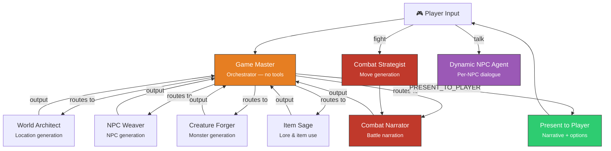
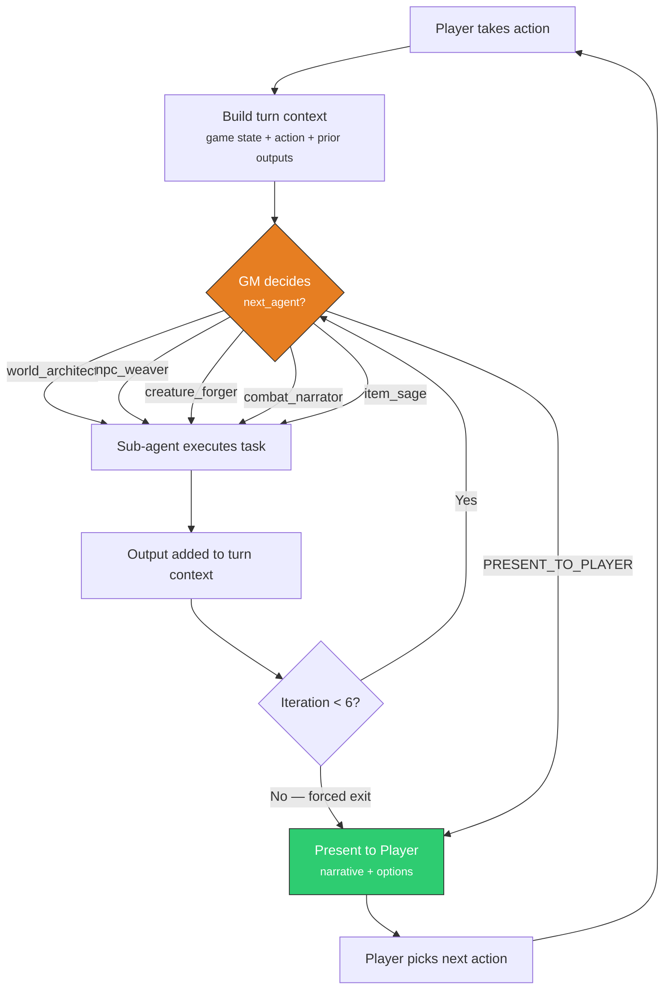
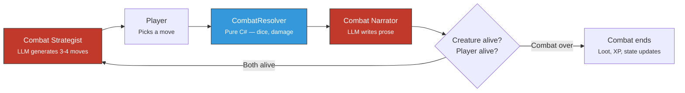
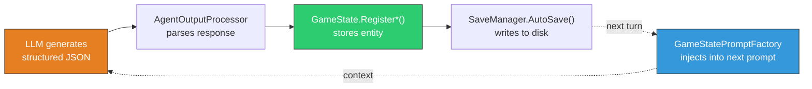

# Bonus Module — RPG Game Master

> **A comprehensive showcase of multi-agent AI orchestration** — 7+ specialised agents collaborate through a Magentic-One-style manager loop, dynamic agent spawning, tool-based function calling, and persistent world state, all applied to an interactive text RPG.

This module goes beyond the workshop's triage-assistant scenario to demonstrate how every concept from Modules 00–09 comes together in a complex, long-running application. It is **not a guided exercise** — it is a **reference architecture** you can study, run, and extend.

> **Prerequisite knowledge:** All core modules (00–06) and orchestration modules (07–09). This module builds directly on Module 09's Magentic-One pattern and extends it with dynamic agent spawning, sub-workflows, and persistent AI-generated state.

---

## What This Module Demonstrates

| Workshop Concept | How It's Applied Here |
|-----------------|----------------------|
| System prompts (01) | 7 specialised prompt files — each shapes a distinct agent personality and output format |
| Function calling (02) | 4 tool classes with 12+ registered functions — agents create, query, and mutate game state |
| Session persistence (03) | Full world state (locations, NPCs, creatures, inventory, quests) serialised to JSON with multi-save support |
| Multi-step workflows (04) | Per-turn inner routing loop chains 1–6 agent calls before presenting results |
| Structured output (04, 06) | Every sub-agent returns JSON matching a defined schema — parsed and registered into game state |
| Human-in-the-loop (05) | Player choices gate every turn — the AI proposes, the human decides |
| Magentic-One orchestration (09) | GM agent dynamically selects which specialist acts next based on evolving context |
| **New: Dynamic agent spawning** | NPC dialogue agents are created at runtime from LLM-generated instructions |
| **New: Code-authoritative mechanics** | AI narrates; C# code resolves dice, damage, and loot deterministically |
| **New: Multi-language generation** | All AI-generated content adapts to the player's chosen language |

---

## Architecture Overview

The system is built around a **Game Master (GM) agent** that acts as a Magentic-One-style manager. Each turn, the GM examines the game state and the player's action, then dynamically routes tasks to specialist agents through an **inner routing loop** (up to 6 iterations). The GM never generates content itself — it only decides *which* specialist should act and *what task* to assign.

Six specialist agents handle content generation — locations, NPCs, creatures, combat moves, battle narration, and item lore. Each has its own system prompt (loaded from Markdown files) and, where needed, registered tools for reading and writing game state. When specific gameplay situations arise (combat, dialogue, trade), dedicated **sub-workflows** take over with their own agent loops.

The key architectural insight is the **separation between AI creativity and game mechanics**. The AI generates narrative, descriptions, and strategic options. The C# code owns all authoritative game logic — dice rolls, damage calculations, inventory management, save/load. This boundary ensures the game is fair and deterministic while the narrative remains rich and unpredictable.

---

## Agent Orchestration



---

## Agent Inventory

The system uses **7 named agent types** plus dynamically spawned agents. Some agents have a second "tool-free generation variant" (`-gen`) used when clean JSON output is needed without function-calling overhead.

| Agent | Prompt File | Role | Tools | Session |
|-------|-------------|------|-------|---------|
| **Game Master** | `game-master.md` | Orchestrator — routes tasks to sub-agents, then presents narrative + options to the player. Never generates content itself. | None | Stateless per-turn |
| **World Architect** | `world-architect.md` | Generates richly described locations with exits, atmosphere, lore, items, points of interest, and secrets. | `SaveLocation`, `LoadLocation`, `ListLocations` | Stateless per-call |
| **NPC Weaver** | `npc-weaver.md` | Creates NPCs with personality, speaking style, backstory, quests, and — crucially — `agent_instructions` that become a live dialogue agent. | `SaveNPC`, `LoadNPC`, `LoadNPCsAtLocation` | Stateless per-call |
| **Creature Forger** | `creature-forger.md` | Creates creatures with stats (HP/Atk/Def), behavior descriptions, lore, and loot tables. Difficulty scales to player level. | `SaveCreature`, `LoadCreature`, `LoadCreaturesAtLocation` | Stateless per-call |
| **Combat Strategist** | `combat-strategist.md` | Generates 3–4 cinematic combat moves per round with risk/reward trade-offs. Does **not** resolve combat. | None | Stateless per-round |
| **Combat Narrator** | `combat-narrator.md` | Turns resolved dice rolls and damage numbers into vivid 2–4 sentence narration. Does **not** calculate anything. | None | Stateless per-round |
| **Item Sage** | `item-sage.md` | Two modes: **Examine** (generates item lore, caches via `SetItemLore`) and **Use** (determines effect, calls `ApplyItemEffect`). | `GetItemDetails`, `SetItemLore`, `ApplyItemEffect` | Stateless per-call |
| **NPC Dialogue** *(dynamic)* | *Generated by NPC Weaver* | Created at runtime per NPC from the NPC's `agent_instructions` field. Each NPC becomes a unique conversational agent with its own personality. | None | Dialogue history persisted on NPC |
| **Merchant** *(dynamic)* | *Inline trade prompt* | Temporary agent created per trade session. Generates shop inventory scaled to player level and gold. | None | Stateless per-trade |

### Tool-Free Generation Variants

For clean JSON output without function-calling overhead, the system creates **tool-free copies** of generation agents. These use the same system prompts but are registered without tools — the LLM produces raw JSON that the workflow code parses directly.

| Variant | Base Agent | Used For |
|---------|-----------|----------|
| `architect-gen` | World Architect | Location generation during `move` actions |
| `npc-gen` | NPC Weaver | NPC generation at new locations |
| `creature-gen` | Creature Forger | Creature generation at new locations |
| `combat-strategist` | Combat Strategist | Move generation during combat |
| `combat-narrator` | Combat Narrator | Round narration during combat |

---

## The Inner Routing Loop

The heart of the orchestration is a **Magentic-One-style inner loop** — directly evolved from Module 09's `MagenticWorkflow`. Each player turn triggers up to 6 routing iterations where the GM agent decides which specialist should act next.



### How It Works

1. **Context assembly** — The workflow builds a `turnContext` list containing the serialised game state, the player's action, and all prior sub-agent outputs from this turn.

2. **GM decision** — The GM agent receives the accumulated context and outputs a JSON routing decision: `{next_agent, reason, task}`. If all generation is complete, it outputs `PRESENT_TO_PLAYER`.

3. **Sub-agent dispatch** — The selected agent is looked up in `agentMap` (a `Dictionary<string, AIAgent>`). Rich generation context is injected via prompt factories for NPC and creature generators.

4. **Output integration** — `AgentOutputProcessor` parses the sub-agent's JSON response and registers entities (locations, NPCs, creatures) into `GameState`. The output is appended to `turnContext`.

5. **Accumulation** — Each iteration's output is visible to the next iteration, so the GM can chain work: e.g., first generate a location, then populate it with NPCs, then add creatures.

6. **Safety cap** — After `MaxInnerIterations` (6), the GM is forced to present results regardless.

### Key Code: The Routing Loop

```csharp
// GameMasterWorkflow.cs — Inner routing loop (simplified)
var turnContext = new List<string>
{
    $"GAME STATE:\n{stateSummary}",
    $"PLAYER ACTION: {playerAction}",
};

while (innerIter < GameConstants.MaxInnerIterations)
{
    innerIter++;
    var contextText = string.Join("\n\n---\n\n", turnContext);

    // 1. GM decides: which agent next, or PRESENT_TO_PLAYER?
    var gmPrompt = "Review the current game state and player's action. " +
        "Decide what sub-agent work is needed, or output PRESENT_TO_PLAYER if ready.\n\n" +
        $"{contextText}\n\n" +
        "Respond with JSON: {\"next_agent\": \"...\", \"reason\": \"...\", \"task\": \"...\"}";

    var decisionText = await AgentRunner.RunAgent(gmAgent, gmPrompt, ct);
    var decision = ParseDecision(decisionText);

    if (decision.NextAgent == "PRESENT_TO_PLAYER") break;

    // 2. Route to selected sub-agent
    var subAgent = agentMap[decision.NextAgent];
    var subPrompt = /* game context + language hint + task */;
    var subResult = await AgentRunner.RunAgent(subAgent, subPrompt, ct);

    // 3. Register generated entities (locations, NPCs, creatures) in GameState
    AgentOutputProcessor.Apply(decision.NextAgent, subResult, state);

    // 4. Accumulate output — next iteration sees prior work
    turnContext.Add($"[{decision.NextAgent}] output:\n{subResult}");
}
```

### Player Action Dispatch

After the GM presents options and the player chooses, a **handler dispatch table** routes to specialised sub-workflows:

| Player Action | Handler | What Happens |
|--------------|---------|-------------|
| `move` | `HandleMove()` | Generates new location → independent NPC/creature spawn rolls → enters location |
| `talk` | `HandleTalk()` | Launches `DialogueWorkflow` — dynamic NPC agent, multi-round conversation |
| `fight` | `HandleFight()` | Launches `CombatWorkflow` — Strategist → CombatResolver → Narrator per round |
| `trade` | `HandleTrade()` | Launches `TradeWorkflow` — temporary merchant agent, shop inventory generation |
| `use_item` | `HandleUseItem()` | Potions: direct code. Others: routes to Item Sage agent |
| `examine` | `HandleExamine()` | Routes to Item Sage for lore generation, caches result on item |
| `pickup` | Direct code | Adds item to inventory, removes from location |
| `rest` | Direct code | Heals 25% of max HP |
| `save_game` | Direct code | Full `GameState` serialised to JSON file |
| `inventory`, `map`, `quests` | Direct code | Displays current state — no LLM calls |

---

## Sub-Workflows

When specific gameplay situations arise, dedicated sub-workflows take over with their own agent loops. Each sub-workflow manages its own agent sessions and returns control to the main GM loop when complete.

### Combat Workflow

The combat system is the clearest example of the **AI-narrates, code-decides** boundary.



Each combat round has three phases:

1. **Strategist** (LLM) — Generates 3–4 situation-specific combat moves with risk/reward trade-offs. Moves reference the creature's name, player's weapon, wounds, and environment. Always includes one safe and one high-risk option.

2. **CombatResolver** (pure C#) — Rolls dice deterministically, calculates hit/miss, damage, critical hits, and healing. **Code-authoritative**: the AI has zero influence on the outcome. The resolver uses `IDiceRoller` (injectable for testing).

3. **Narrator** (LLM) — Receives the fully resolved outcome (all dice values, damage numbers, HP changes) and writes 2–4 sentences of dramatic narration. Must not invent numbers or contradict the resolved result.

After combat ends, rewards (XP, gold, loot) are calculated in code, and nearby NPCs' disposition improves (they appreciate the player clearing dangers).

### Dialogue Workflow — Dynamic Agent Spawning

This is a pattern unique to the Bonus module: **an LLM generates another LLM's system prompt**.

When the NPC Weaver creates an NPC, one of the JSON fields it produces is `agent_instructions` — an 80–150 word system prompt that captures the NPC's personality, speaking style, knowledge, and secrets. When the player talks to that NPC, a new `AIAgent` is created at runtime using those instructions:

```csharp
// DialogueWorkflow.cs — Dynamic agent creation from LLM-generated instructions
var npcInstructions = NPCPromptFactory.BuildDialogueInstructions(npc, state.Language);
var npcAgent = config.CreateAgent(npcInstructions);

// Seed from persisted dialogue so the NPC "remembers" past conversations
var dialogueHistory = new List<string>(npc.DialogueHistory);

var openingPrompt = npc.HasMet
    ? $"The adventurer {state.Player.Name} approaches you again."
    : $"An adventurer named {state.Player.Name} approaches you for the first time.";
```

The dialogue loop runs up to 10 rounds. The NPC agent can organically offer quests (signaling `quest_accepted: true` in its JSON response when the player agrees). Dialogue history is persisted on the `NPC` model — the only place in the system where an AI agent has cross-session memory.

### Trade Workflow

Creates a temporary merchant agent per trade session. The LLM generates a shop inventory (3–5 items scaled to player level and gold). Buy/sell mechanics are code-authoritative — the AI describes the items, but gold arithmetic is handled in C#.

### Item Sage Workflow

The Item Sage agent operates in two modes:

- **Examine**: Generates 3–5 sentences of lore scaled by item rarity (common → mundane, legendary → epic). Calls `SetItemLore` tool to cache the result on the item — subsequent examinations return the cached lore without an LLM call.
- **Use**: Determines the item's effect (`heal`, `unlock`, or `narrative_only`) and calls `ApplyItemEffect` tool. The tool applies the effect in code.

---

## Tools & Function Calling

Agents interact with game state through registered tools — C# methods exposed via `AIFunctionFactory.Create()`. Each tool is a static method decorated with `[Description]` attributes that the LLM sees as part of its tool schema.

| Tool Class | Methods | Assigned To | Purpose |
|-----------|---------|-------------|---------|
| `LocationTools` | `SaveLocation`, `LoadLocation`, `ListLocations` | World Architect | CRUD for Location entities in `GameState.Locations` |
| `NPCTools` | `SaveNPC`, `LoadNPC`, `LoadNPCsAtLocation` | NPC Weaver | CRUD for NPC entities in `GameState.NPCs` |
| `CreatureTools` | `SaveCreature`, `LoadCreature`, `LoadCreaturesAtLocation` | Creature Forger | CRUD for Creature entities in `GameState.Creatures` |
| `ItemTools` | `GetItemDetails`, `SetItemLore`, `ApplyItemEffect` | Item Sage | Inventory queries, lore caching, effect application |

### Tool Registration Pattern

```csharp
// LocationTools.cs — Tool registration with AIFunctionFactory
internal static class LocationTools
{
    [Description("Saves a location to persistent storage. Input: the full JSON of the Location object.")]
    public static string SaveLocation(
        [Description("Full JSON of the Location object")] string locationJson)
        => GameStateRepository.Save<Location>(locationJson, gs => gs.Locations, "Location");

    [Description("Lists all saved locations. Returns a JSON array of {id, name} objects.")]
    public static string ListLocations()
    {
        var summaries = GameStateAccessor.Current.Locations.Values
            .Select(loc => new { loc.Id, loc.Name, loc.Theme, ExitCount = loc.Exits.Count });
        return JsonSerializer.Serialize(summaries, LlmJsonParser.JsonOpts);
    }

    public static IList<AITool> GetTools() =>
    [
        AIFunctionFactory.Create(SaveLocation),
        AIFunctionFactory.Create(LoadLocation),
        AIFunctionFactory.Create(ListLocations),
    ];
}
```

### Why GameStateAccessor?

`AIFunctionFactory.Create` requires **static methods** — it cannot capture instance state. The `GameStateAccessor` class provides a static singleton reference to the current `GameState`, set once at workflow start:

```csharp
GameStateAccessor.Set(state);  // All tool classes now see this state
```

This is a framework limitation noted in the codebase. When the framework supports instance-based tool registration, the pattern can be replaced with constructor-injected dependencies.

---

## Prompt Architecture

Prompts are the primary mechanism for controlling agent behaviour. The system uses a **layered composition** pattern where multiple context sources are combined into a single instruction string per LLM call.

### Prompt Layers

```
┌──────────────────────────────────────────────────┐
│  Layer 1: System Prompt (from .md file)          │
│  ─ Agent role, output format, constraints        │
│  ─ Loaded once by PromptLoader, cached           │
├──────────────────────────────────────────────────┤
│  Layer 2: Generation Context (from PromptFactory)│
│  ─ World state: existing entities, dedup lists   │
│  ─ Current location, player stats, quest state   │
│  ─ Dynamic — rebuilt per call                    │
├──────────────────────────────────────────────────┤
│  Layer 3: Task Instruction (inline in workflow)  │
│  ─ GM's specific assignment for this iteration   │
│  ─ e.g. "Generate a creature for the Dark Cave"  │
├──────────────────────────────────────────────────┤
│  Layer 4: Language Hint                          │
│  ─ "All player-facing text MUST be in German."   │
│  ─ No-op for English                             │
└──────────────────────────────────────────────────┘
```

### PromptLoader

Loads Markdown files from `assets/prompts/{name}.md` with an in-memory cache. Falls back to `"You are the {name} agent."` if the file is missing (with a warning logged). This means you can edit any prompt file and see changes immediately on the next `dotnet run` — no recompilation needed.

```csharp
// PromptLoader.cs — File-based prompt loading with cache
var instructions = PromptLoader.Load(AgentNames.GameMasterPrompt);
// → Loads assets/prompts/game-master.md, caches for process lifetime
```

### Prompt Factories

Four specialised factories inject **dynamic game context** so the LLM has full awareness of the world state:

| Factory | Injected Context | Used By |
|---------|-----------------|---------|
| `GameStatePromptFactory` | Full game state summary — player stats, current location details, NPCs, creatures, items, recent game log | Game Master (every turn) |
| `LocationPromptFactory` | From-location, exit direction, existing location types/atmospheres (for dedup), player level, world theme | World Architect |
| `NPCPromptFactory` | Existing NPC names/occupations (dedup), nearby creatures, location details, player history with this location | NPC Weaver |
| `CreaturePromptFactory` | Difficulty tier (scaled to player level), existing creatures (dedup), location danger level, world theme | Creature Forger |

This context injection is how **stateless agents produce contextually coherent content** — they don't remember previous calls, but they receive all relevant world state in every prompt.

### Prompt Files

All agent prompts live in `assets/prompts/`:

| File | Agent | Key Instructions |
|------|-------|-----------------|
| `game-master.md` | GM | Two output modes (routing decision vs. player presentation), 14 action types, spawn rules with probabilities, reactive spawning rules, pacing guidance |
| `world-architect.md` | World Architect | Structured Location JSON schema, 18 location types, 10 atmosphere values, 4 danger levels, sensory detail requirements, exit connectivity rules |
| `npc-weaver.md` | NPC Weaver | NPC JSON schema with `agent_instructions` field (80–150 word system prompt for dialogue), speaking style must be "concrete and distinctive", quest structure |
| `creature-forger.md` | Creature Forger | Creature JSON with stats scaled by difficulty tier, combat behavior descriptions, loot tables, quest-target awareness |
| `combat-strategist.md` | Combat Strategist | 3–4 `CombatMove` objects per round, move types (attack/heavy/defensive/flee/item), situation-specific references, risk/reward balancing |
| `combat-narrator.md` | Combat Narrator | 2–4 sentence narration from resolved outcomes, must not invent numbers, second-person perspective |
| `item-sage.md` | Item Sage | Two modes (Examine/Use), lore depth scales with rarity, tool calls for `SetItemLore` and `ApplyItemEffect` |

---

## State & Persistence — The AI Perspective

### Stateless Agents, Stateful World

Every AI agent call creates a **fresh session** — there is no persistent conversation memory at the agent level. This is a deliberate architectural choice:

- **Why?** Long-running games would accumulate enormous conversation histories, exceeding context windows and inflating token costs. Fresh sessions keep each call focused and predictable.
- **How does context survive?** Through `GameStatePromptFactory`, which serialises the current world state into text and injects it into every prompt. The agent sees the *result* of prior work without needing the conversation that produced it.

### The State Lifecycle



1. **AI generates** — A sub-agent (e.g., World Architect) produces a structured JSON object describing a location, NPC, or creature.

2. **Code parses** — `AgentOutputProcessor.Apply()` deserialises the JSON into a domain entity (e.g., `Location`, `NPC`, `Creature`).

3. **Code registers** — `GameState.RegisterLocation()` / `RegisterNPC()` / `RegisterCreature()` stores the entity in the appropriate dictionary and updates cross-references (e.g., linking an NPC to its location).

4. **Code persists** — `SaveManager.AutoSave()` serialises the entire `GameState` to a JSON file after every turn. The player can also manually save at any time.

5. **Context reconstructed** — On the next turn, `GameStatePromptFactory.Build()` serialises the current state into text that is injected into the GM's prompt. The cycle repeats.

### AI-Generated Entities Become Persistent State

This is the central pattern: **the AI produces data, the code owns it**. When the NPC Weaver generates an NPC, that NPC's data (name, personality, stats, `agent_instructions`, quests) becomes a first-class object in `GameState`. It persists across saves, survives process restarts, and is available to any future LLM call as context.

The AI cannot modify persisted state directly — all mutations go through code-authoritative methods (`RegisterNPC`, `RegisterCreature`, tool handlers like `SaveLocation`). This prevents the LLM from accidentally corrupting game state.

### NPC Dialogue History — Cross-Session Memory

NPC dialogue is the **one exception** to the stateless-agents rule. Each NPC stores its `DialogueHistory` (capped at 20 entries) as part of `GameState`. When the player talks to an NPC again, the history is replayed into the dynamic agent's prompt:

```csharp
// Seed from persisted dialogue so the NPC "remembers" past conversations
var dialogueHistory = new List<string>(npc.DialogueHistory);
if (npc.HasMet && npc.DialogueHistory.Count > 0)
{
    openingPrompt += "\n\nPrevious conversations:\n" +
        string.Join("\n", npc.DialogueHistory.TakeLast(10));
}
```

This creates the illusion of persistent NPC memory — the NPC "remembers" you, references past conversations, and evolves its attitude based on accumulated interactions. The `disposition_toward_player` value also changes through gameplay events: +5 per conversation, +10 when you defeat nearby creatures, +20 on quest completion.

### GameState Structure

```csharp
// GameState.cs — The serialisable root
internal sealed class GameState
{
    public EntityId SaveId { get; set; }           // Unique 8-char hex per save
    public PlayerCharacter Player { get; set; }     // Name, HP, stats, inventory, quests
    public EntityId CurrentLocationId { get; set; }
    public string WorldTheme { get; set; }          // Persisted world theme
    public string Language { get; set; }            // Language for LLM generation
    public int TurnCount { get; set; }

    public Dictionary<string, Location> Locations { get; set; }
    public Dictionary<string, NPC> NPCs { get; set; }
    public Dictionary<string, Creature> Creatures { get; set; }
    public List<string> GameLog { get; set; }       // Rolling log, capped at 20
}
```

### Multi-Save Support

`SaveManager` supports multiple concurrent save files, named `save_{playerName}_{saveId}.json`. The player can create multiple characters, save/load independently, and the system handles legacy save migration. AutoSave runs silently after every turn — failures are swallowed to avoid disrupting gameplay.

---

## Agent Resilience

Long-running game sessions make reliability critical. The `AgentRunner` wraps every LLM call with:

| Protection | Value | Purpose |
|-----------|-------|---------|
| Per-call timeout | 45 seconds | Prevents hanging on unresponsive Azure OpenAI calls |
| Exponential backoff retry | 2 retries, 2s → 4s | Recovers from transient failures (429, network blips) |
| Partial content recovery | On timeout | Returns whatever was streamed before timeout, rather than failing entirely |
| Fallback JSON | Per agent | If all retries fail, a safe default JSON prevents workflow crashes |
| User cancellation | Ctrl+C | Propagates immediately — distinguished from timeout cancellation |

```csharp
// AgentRunner.cs — Timeout + retry pattern (simplified)
for (var attempt = 1; attempt <= maxAttempts; attempt++)
{
    using var timeoutCts = CancellationTokenSource.CreateLinkedTokenSource(ct);
    timeoutCts.CancelAfter(TimeSpan.FromSeconds(GameConstants.AgentCallTimeoutSeconds));

    var session = await agent.CreateSessionAsync(linkedCt);
    await foreach (var update in agent.RunStreamingAsync(prompt, session))
    {
        sb.Append(update.Text);
    }
    return sb.ToString().Trim();
}
```

---

## Agent Creation & Configuration

All agents are created through `AgentConfig`, which wraps the Azure OpenAI client setup:

```csharp
// AgentConfig.cs — Agent creation from Azure OpenAI credentials
public AIAgent CreateAgent(string instructions, IList<AITool>? tools = null)
    => CreateChatClient().AsAIAgent(instructions, tools: tools);

// GameMasterWorkflow.cs — Agent setup at game start
var gmAgent     = config.CreateAgent(PromptLoader.Load(AgentNames.GameMasterPrompt));
var worldArch   = config.CreateAgent(PromptLoader.Load(AgentNames.WorldArchitectPrompt),
                      tools: LocationTools.GetTools());
var npcWeaver   = config.CreateAgent(PromptLoader.Load(AgentNames.NPCWeaverPrompt),
                      tools: NPCTools.GetTools());
var creatureGen = config.CreateAgent(PromptLoader.Load(AgentNames.CreatureForgerPrompt));
// ↑ tool-free variant — same prompt, no tools, for clean JSON generation
```

All agents share the same Azure OpenAI deployment. Token usage is tracked across all agents via a `TokenTracker` delegating chat client and displayed on exit.

---

## Key Patterns Summary

This module demonstrates the following AI agent orchestration patterns — each builds on concepts introduced in the core workshop:

- **Magentic-One inner routing** — GM agent dynamically selects sub-agents per turn, accumulating context across iterations (evolved from Module 09)
- **Dynamic agent spawning** — NPC dialogue agents are created at runtime from LLM-generated system prompts — an LLM generates another LLM's instructions
- **Tool-free generation variants** — Same agent prompts registered without tools, producing clean JSON without function-calling overhead
- **Code-authoritative mechanics** — AI generates narrative and options; C# code resolves dice, damage, loot, and state mutations deterministically
- **Stateless agents with reconstructed context** — Fresh session per call; world state injected via prompt factories instead of persistent conversation history
- **Prompt factories for rich context injection** — Specialised builders that serialise game state, dedup lists, and generation constraints into each LLM prompt
- **AI-generated persistent state** — LLM outputs are parsed, registered into `GameState`, and serialised to disk — AI produces data, code owns it
- **Cross-session NPC memory** — Dialogue history persisted on domain model and replayed into dynamic agent prompts
- **Reactive spawning via prompt guidance** — NPC/creature spawns triggered by player actions (knocking, searching, exploring) through GM prompt rules rather than code logic
- **Multi-language AI generation** — Language hint injected into every prompt; JSON keys stay English, player-facing text adapts
- **Agent timeout + retry resilience** — Per-call timeout with exponential backoff and partial content recovery for long-running sessions

---

## Project Structure

```
Bonus/
  Program.cs                    ← Entry point: main menu, new/load game
  AgentConfig.cs                ← Azure OpenAI setup, agent creation
  AgentOutputProcessor.cs       ← Routes sub-agent JSON → GameState registration
  GameStateAccessor.cs          ← Static singleton for tool access to GameState
  Domain/
    GameState.cs                ← Serialisable root: player, locations, NPCs, creatures
    PlayerCharacter.cs          ← Player stats, inventory, quests
    Location.cs                 ← Generated location with exits, items, secrets
    NPC.cs                      ← Generated NPC with agent_instructions, dialogue history
    Creature.cs                 ← Generated creature with stats, loot, behavior
    Item.cs                     ← Items with type, rarity, lore
    Enums.cs                    ← DangerLevel, ItemType with spawn probabilities
    Combat/                     ← Combat domain: CombatMove, CombatResolver, CombatResult
  Infrastructure/
    PromptLoader.cs             ← File-based prompt loading with cache
    SaveManager.cs              ← Multi-save persistence (save/load/autosave/migrate)
  Prompts/
    GameStatePromptFactory.cs   ← Builds full state summary for GM
    LocationPromptFactory.cs    ← Generation context for World Architect
    NPCPromptFactory.cs         ← Generation context for NPC Weaver + dialogue prompt builder
    CreaturePromptFactory.cs    ← Generation context for Creature Forger
    LanguageHint.cs             ← Injects language requirement into prompts
  Tools/
    LocationTools.cs            ← SaveLocation, LoadLocation, ListLocations
    NPCTools.cs                 ← SaveNPC, LoadNPC, LoadNPCsAtLocation
    CreatureTools.cs            ← SaveCreature, LoadCreature, LoadCreaturesAtLocation
    ItemTools.cs                ← GetItemDetails, SetItemLore, ApplyItemEffect
    GameTools.cs                ← RollDice, GetPlayerStats, UpdatePlayerStats
  Workflow/
    GameMasterWorkflow.cs       ← Core game loop with inner routing
    CombatWorkflow.cs           ← 3-phase combat: Strategist → Resolver → Narrator
    DialogueWorkflow.cs         ← Dynamic NPC agent conversation loop
    TradeWorkflow.cs            ← Merchant agent and shop mechanics
    AgentRunner.cs              ← Timeout + retry wrapper for all LLM calls
  Shared/
    AgentNames.cs               ← Canonical agent/prompt name constants
    GameConstants.cs             ← Tuning constants (spawn rates, timeouts, rewards)
  UI/
    GameConsoleUI.cs            ← Console output formatting
    ConsoleSpinner.cs           ← Async spinner for LLM wait times
    UIStrings.cs                ← Multi-language UI text
  assets/
    prompts/
      game-master.md            ← GM orchestrator prompt (routing + presentation rules)
      world-architect.md        ← Location generation schema and constraints
      npc-weaver.md             ← NPC generation with agent_instructions
      creature-forger.md        ← Creature generation with stat scaling
      combat-strategist.md      ← Combat move generation rules
      combat-narrator.md        ← Battle narration from resolved outcomes
      item-sage.md              ← Item lore and use-effect determination
```

---

## How to Run

```bash
# From the repository root
./scripts/run.sh Bonus        # Linux/macOS
./scripts/run.ps1 Bonus       # Windows PowerShell

# Or directly
dotnet run --project modules/Bonus
```

> **Note:** This is an interactive game, not a one-shot analysis. A typical session makes 20–100+ LLM calls across multiple agents. Ensure your Azure OpenAI deployment has adequate TPM (tokens per minute) capacity. The game displays a token usage summary on exit.

---

## NuGet Packages Used

| Package | Purpose |
|---------|---------|
| `Microsoft.Agents.AI` | Core Agent Framework — `AIAgent`, `AgentSession` |
| `Microsoft.Agents.AI.OpenAI` | Azure OpenAI provider registration |
| `Microsoft.Extensions.AI` | `IChatClient`, `AIFunctionFactory`, `AITool` |
| `Microsoft.Extensions.AI.OpenAI` | `AsIChatClient()` extension |
| `Azure.AI.OpenAI` | Azure OpenAI SDK — HTTP client, authentication |

> This module intentionally does **not** use `Microsoft.Agents.AI.Workflows`. Like Module 09, it implements orchestration manually to demonstrate how the pattern works under the hood.

---

**[← Back to Module 09](../09_Magentic_ManagerOrchestration/README.md)** · **[← Back to Workshop Overview](../../README.md)** · **[☕ Support](../../README.md#-support)**
